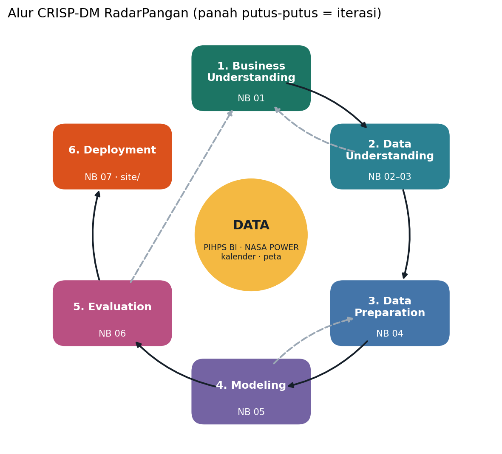

# RadarPangan
**Peringatan dini lonjakan harga pangan + peta rambatannya antarprovinsi**

Lomba Implementasi Data Mining — USB 2026 (LABSI Universitas Gunadarma).
Folder ini berisi alur **CRISP-DM** lengkap: *scraping* PIHPS → pemahaman data → persiapan data → pemodelan → evaluasi → *deployment* dashboard.

> Semua notebook **sudah dijalankan pada data asli** PIHPS Bank Indonesia (Jan 2018 – 25 Sep 2026).
> Angka hasil di bawah berasal dari uji **out-of-sample walk-forward** 19 fold (Jan 2022 – Sep 2026):
> model tidak pernah melihat data periode uji saat dilatih.



## Ringkasan 30 detik

| | |
|---|---|
| **Masalah** | Lonjakan harga pangan datang tiba-tiba, berbeda antarprovinsi, dan merambat. Informasi yang ada (PIHPS) hanya menunjukkan harga hari ini. |
| **Data** | PIHPS Bank Indonesia: 21 varian (10 komoditas) × 4 jenis pasar (tradisional, modern, pedagang besar, produsen) × 34 provinsi + nasional, harian 2018–2026 (**5.450.980 baris**) + curah hujan NASA POWER + kalender hari besar resmi |
| **Target** | Onset lonjakan = harga konsumen naik melewati ambang dalam 14 hari (15%; beras 5%; gula/minyak/daging sapi 7,5%). Label: ada onset dalam **14 hari ke depan**? (8.457 kejadian) |
| **Metode** | 78 fitur dari 8 kelompok sinyal (dinamika harga, nasional, rantai pasok/margin, tetangga, provinsi pemimpin hasil uji Granger, kalender, curah hujan, identitas) → **LightGBM**, dibandingkan dengan naive "harga minggu lalu", seasonal naive, SARIMA, dan regresi logistik; walk-forward + *purge* 14 hari; SHAP |
| **Hasil** | PR-AUC **0,501** vs 0,256 (naive) = **1,96×**; **85%** kejadian lonjakan didahului alarm (cabai & bawang ±96–98%, beras hanya 25%), median *lead time* **11 hari**; semua kriteria sukses tercapai |
| **Prototipe** | Dashboard statis peta risiko 14 hari (`site/`) + alasan setiap alarm + peta rambatan → hosting gratis + QR poster |

## Alur CRISP-DM → file

| Fase | File | Isi utama | Output |
|---|---|---|---|
| 1. Business Understanding | `notebooks/01_business_understanding.ipynb` | Latar belakang, tujuan bisnis & stakeholder, penilaian situasi, definisi target, kriteria sukses, rencana proyek | Definisi masalah & target |
| 2. Data Understanding | `notebooks/02_data_collection_scraping.ipynb` | Membongkar API PIHPS, scraping 4 jenis pasar × 21 varian × 2018–kini, NASA POWER, kalender | `data/raw/`, `data/interim/` |
| | `notebooks/03_data_understanding_eda.ipynb` | Deskripsi, kualitas data, volatilitas & **penyesuaian ambang**, musiman Idulfitri, spasial, rantai pasok, hujan | Temuan & implikasi |
| 3. Data Preparation | `notebooks/04_data_preparation.ipynb` | Pembersihan, label lonjakan, **jaringan rambatan (Granger + FDR)**, 78 fitur, **uji leakage** | `data/processed/` |
| 4. Modeling | `notebooks/05_modeling.ipynb` | Tuning (hanya data < 2022), walk-forward 19 fold, SARIMA, ablation | Prediksi out-of-sample |
| 5. Evaluation | `notebooks/06_evaluation.ipynb` | PR-AUC, FAR, lead time, per kategori, trade-off ambang, SHAP, studi kasus, validasi jaringan, cek kriteria sukses | `reports/tables`, `reports/figures` |
| 6. Deployment | `notebooks/07_deployment.ipynb`, `run_pipeline.py`, `site/`, `deployment/` | Model final, prediksi 14 hari + alasan, dashboard, QR, update harian, monitoring (drift, performa) | Dashboard publik |

## Struktur folder

```
MiningProcess/
├── README.md                  ← file ini
├── config.yaml                ← semua parameter: periode, ambang lonjakan, fitur, validasi, model
├── requirements.txt
├── run_pipeline.py            ← pipeline tanpa notebook (scrape / prepare / evaluate / train / predict / update)
├── notebooks/                 ← 7 notebook CRISP-DM (sudah berisi output run asli)
├── src/radarpangan/           ← kode modular yang dipakai notebook & pipeline
│   ├── scraper.py             ← client API PIHPS + cache per bulan (resume)
│   ├── weather.py             ← curah hujan NASA POWER + anomali vs klimatologi 1991–2017
│   ├── reference.py           ← provinsi (koordinat, tetangga), kalender hari besar
│   ├── cleaning.py            ← salah input, smoothing, panel kalender harian
│   ├── labeling.py            ← definisi lonjakan, onset, label peringatan dini
│   ├── network.py             ← Granger bersyarat + FDR + presedensi kejadian → provinsi pemimpin
│   ├── features.py            ← 78 fitur (+ kamus fitur)
│   ├── models.py              ← naive, seasonal naive, SARIMA, regresi logistik, LightGBM
│   ├── validation.py          ← walk-forward + purge
│   ├── metrics.py / evaluation.py ← PR-AUC, FAR, deteksi kejadian, lead time, episode alarm palsu
│   ├── explain.py             ← SHAP (TreeSHAP LightGBM) + alasan alarm dalam bahasa awam
│   ├── pipeline.py / site.py  ← orkestrasi & ekspor dashboard
│   └── viz.py, geo.py, config.py
├── data/
│   ├── raw/pihps/             ← cache scraping apa adanya (JSON.gz per jenis pasar/varian/bulan)
│   ├── raw/weather/           ← curah hujan per provinsi (CSV)
│   ├── external/              ← referensi PIHPS, provinsi, hari besar, GeoJSON 34 provinsi
│   ├── interim/               ← tabel long gabungan (dibuat NB02)
│   ├── processed/             ← panel, kejadian, jaringan, fitur, prediksi out-of-sample (dibuat NB04–05)
│   └── output/                ← risk_latest.csv (prediksi terbaru)
├── models/                    ← lgbm_final.txt, model_meta.json, lgbm_best_params.json
├── reports/figures, tables/   ← grafik & tabel siap tempel ke proposal / poster / PPT
├── site/                      ← dashboard statis = prototipe untuk QR poster
├── deployment/                ← template dashboard, make_qr.py, update_harian.bat, README_deploy.md
├── docs/                      ← kamus data, model card, ringkasan hasil untuk proposal
└── .github/workflows/         ← update otomatis harian (GitHub Actions + Pages)
```

## Cara menjalankan (Windows)

Dengan **Anaconda / Miniconda** (Anaconda Prompt):
```bat
cd C:\Users\Bio\Documents\USB-DataMining\MiningProcess
conda create -n radarpangan python=3.11 -y
conda activate radarpangan
pip install -r requirements.txt
jupyter lab
```
Atau dengan `venv` biasa: `python -m venv .venv` → `.venv\Scripts\activate` → `pip install -r requirements.txt`.

Jalankan notebook **berurutan 01 → 07**. Cache scraping (`data/raw`) sudah terisi, jadi notebook 02 hanya mengambil ulang 2 bulan terakhir (± 3–5 menit), bukan 8.820 request dari nol.
Perkiraan waktu di laptop 8 core: NB02 ± 5 menit, NB03–04 ± 1–2 menit, **NB05 ± 45–90 menit** (tuning + walk-forward + SARIMA + ablation; ablation paling lama — bisa dimatikan lewat `RUN_TUNING/RUN_SARIMA/RUN_ABLATION`), NB06 ± 4 menit, NB07 ± 2 menit.

> `data/processed/features.parquet` & `features_final.parquet` (±135 MB masing-masing) **tidak disertakan** supaya folder ringan — keduanya dibuat ulang otomatis oleh **NB04 (±1 menit)**. Jalankan NB04 dulu sebelum NB05/06/07 atau `run_pipeline.py`.

Tanpa notebook:
```bat
python run_pipeline.py all        :: scrape -> prepare -> evaluate -> train -> predict (+ site/)
python run_pipeline.py update     :: rutinitas harian: data terbaru -> prediksi -> site/
```
Lihat dashboard: `python -m http.server 8000 --directory site` lalu buka `http://localhost:8000`.
Hosting + QR poster: **`deployment/README_deploy.md`**.

## Hasil utama (out-of-sample Jan 2022 – Sep 2026)

| Model | PR-AUC | ROC-AUC | Presisi | Recall | FAR | Deteksi kejadian | Median lead | Episode alarm palsu/seri/thn |
|---|---|---|---|---|---|---|---|---|
| Naive "harga minggu lalu" | 0,256 | 0,615 | 0,308 | 0,352 | 69% | 85% | 7 hari | 2,68 |
| Seasonal naive (tahun lalu) | 0,114 | 0,507 | 0,176 | 0,277 | 82% | 50% | 13 hari | 2,00 |
| Regresi logistik | 0,398 | 0,878 | 0,377 | 0,517 | 62% | 79% | 11 hari | 1,64 |
| **LightGBM** | 0,501 | 0,920 | 0,452 | 0,540 | 55% | 85% | 11 hari | 1,30 |

- **Deteksi kejadian** = % onset lonjakan yang didahului ≥ 1 alarm dalam 14 hari sebelumnya; **lead** = jarak alarm pertama ke onset.
- **FAR** (*false alarm ratio*) = % hari beralarm yang tidak diikuti lonjakan; bisa ditekan dengan menaikkan ambang (kurva trade-off: `reports/figures/fig_06_03_tradeoff_ambang.png`).
- Fitur paling berpengaruh (SHAP): `vol_30`, `commodity_code`, `vol_14`, `lead_ret_14_mean`, `province_code`, `lead_ret_7_mean`, `nbr_rel_price`, `ret_7`.
- Detail per kategori, SARIMA, ablation, dan cek kriteria sukses: `docs/ringkasan_hasil_untuk_proposal.md`.

## Keputusan desain (bekal tanya-jawab juri)

| Pertanyaan | Jawaban singkat |
|---|---|
| Kenapa ambang lonjakan beda per komoditas? | Dengan 15%, beras hampir tidak pernah "lonjak" (≈0,01 kejadian/provinsi/tahun) padahal paling penting. Ambang disesuaikan ke ≈ persentil-99 kenaikan 14 hari: beras 5%, gula/minyak/daging sapi 7,5%, lainnya 15% (NB03). |
| Kenapa PR-AUC, bukan akurasi? | Lonjakan itu langka (±5–6% baris). Model yang selalu menebak "tidak lonjak" akurasinya ±94% tapi tidak berguna. PR-AUC fokus pada kelas langka; baseline acak = proporsi positif. |
| Bagaimana mencegah kebocoran data? | Walk-forward + *purge* 14 hari (label melihat 14 hari ke depan), fitur hanya jendela ke belakang (dibuktikan dengan uji leakage NB04), klimatologi hujan 1991–2017, provinsi pemimpin untuk evaluasi hanya dari data ≤ 2021, tuning hanya data < 2022. |
| Kenapa satu model global, bukan per provinsi? | Kejadian di satu seri sedikit; model global belajar pola lintas 703 seri. Identitas komoditas/provinsi tetap masuk sebagai fitur kategori. |
| "Provinsi pemimpin" itu apa? | Hasil uji Granger bersyarat (dikontrol tren nasional, koreksi FDR): kenaikan harga provinsi A minggu-minggu sebelumnya membantu memprediksi provinsi B. Divalidasi ulang pada periode 2022+ (NB06 6.8). Ini keterdahuluan statistik, bukan bukti sebab-akibat fisik. |
| Apakah margin produsen–konsumen benar sinyal awal? | **Tidak terbukti**: tidak berkorelasi linear dengan kenaikan harga ke depan (NB03) dan tidak menambah PR-AUC di model (ablation NB06; hanya sedikit membantu daging ayam & minyak goreng). Dilaporkan apa adanya sebagai temuan. Sinyal yang terbukti penting: kalender & rambatan spasial. |
| Kenapa dashboard statis, bukan Streamlit? | QR poster dibuka juri dari HP kapan saja: situs statis tidak "tidur", cepat, gratis, dan cukup diperbarui sekali sehari. |

## Sumber data & lisensi
- **PIHPS Nasional – Bank Indonesia**, https://www.bi.go.id/hargapangan — data publik; dipakai untuk riset non-komersial dengan menyebut sumber. Scraper memakai jeda antar-request dan jumlah worker kecil.
- **NASA POWER** (NASA Langley Research Center), https://power.larc.nasa.gov — curah hujan harian PRECTOTCORR.
- **geoBoundaries** gbOpen IDN ADM1 — © OpenStreetMap contributors, lisensi ODbL 1.0.
- Tanggal hari besar: hasil sidang isbat / SKB pemerintah (2017–2026), estimasi kalender Hijriah untuk 2027+.

## Troubleshooting
| Gejala | Solusi |
|---|---|
| Scraping lambat / timeout | Server BI memang lambat; kurangi `scraping.workers`, jalankan ulang (otomatis lanjut dari cache). |
| `HTTP 403/5xx` dari bi.go.id | Tunggu beberapa menit; jalankan ulang. Jika dari GitHub Actions terus gagal, jalankan update dari laptop (Indonesia). |
| Memori penuh di NB05 | Turunkan `model.neg_sample_rate` (mis. 0.3) atau set `RUN_ABLATION = False`. |
| Dashboard kosong saat buka `index.html` langsung | Harus lewat server: `python -m http.server 8000 --directory site`. |
| Error `jinja2` saat menampilkan tabel | `pip install jinja2`. |
